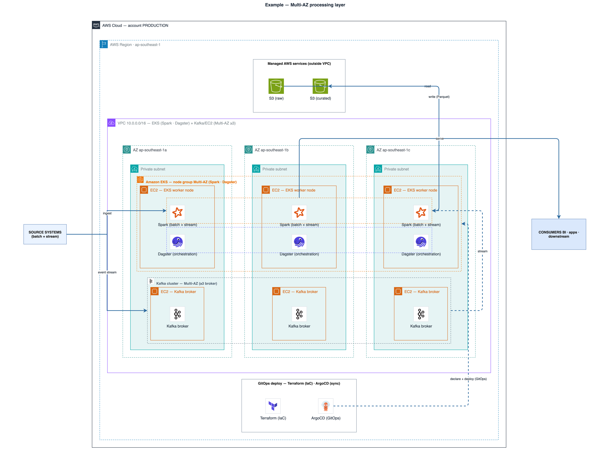
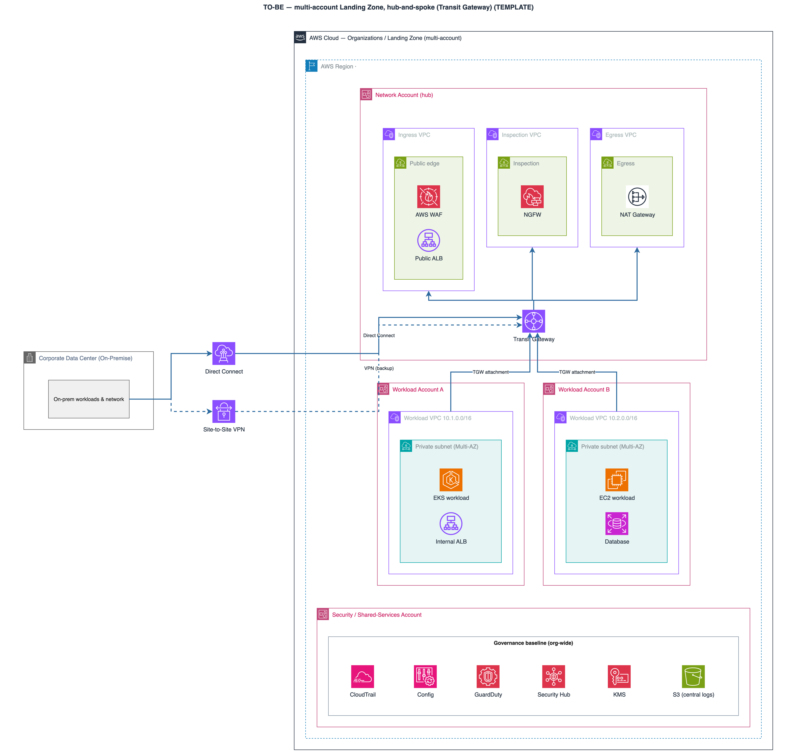

# drawio-ai-kit

A support kit that lets an AI draw **beautiful, correct** draw.io diagrams — especially AWS architectures.

[](https://github.com/sparklabx/drawio-ai-kit/actions/workflows/ci.yml) [](LICENSE) 

It solves the real failure mode (an AI inventing stencil names → blank icons) with three pieces:

1. **Catalog** — ground-truth list of draw.io stencil names (`mxgraph.aws4.*`) + category + canonical color.
2. **Rules** — encoded layout/design principles (`rules/principles.md`).
3. **Validator** — lints diagram XML so every icon reference is real before it ships.

Exposed to the AI as an **MCP server** and runnable directly as a **CLI**.

## Showcase

Generated end-to-end by the kit — no hand-placed coordinates, real stencils, validated, vision-checked.

**Multi-AZ workload layer** — AZ private-subnet columns · pods on EC2 worker nodes · per-app cross-AZ `clusterBox` · GitOps band:



**Multi-account Landing Zone (hub-and-spoke)** — Network account + Transit Gateway · Ingress/Inspection/Egress VPCs · workload spokes · hybrid · governance:



## Quick start

```bash
git clone https://github.com/sparklabx/drawio-ai-kit.git && cd drawio-ai-kit
bash install.sh
```

The installer detects which agents are on your machine (Claude Code, Claude Desktop, Cursor, Gemini CLI, Antigravity CLI, Codex), asks you to pick, then wires the MCP server and skill into each one. **Restart the agent after installing** — MCP servers load only at startup.

## Is it safe to install?

Short answer: yes — and you don't have to take my word for it.

- **No hidden code.** No `postinstall` (or any lifecycle) hooks — nothing runs on `npm install`. The installer is local-only: `npm install`, register the MCP server, symlink the skill. **No `sudo`, no `curl | bash`, no remote code.** It's short — read it before you run it.
- **Tiny, pinned surface.** One runtime dependency — the official `@modelcontextprotocol/sdk` — pinned via `package-lock.json`. `npm audit`: **0 vulnerabilities**, enforced in CI.
- **Runs locally, no telemetry.** The MCP server and CLI only read/write local files. The single optional outbound call is icon-logo fetching from public CDNs (lobe-icons), and it's opt-in.
- **Easy to undo:**

```bash
claude mcp remove drawio-ai-kit --scope user   # or remove it from your host's MCP config
rm ~/.agents/skills/drawio-aws-architect
```

To report a security issue, see [`SECURITY.md`](SECURITY.md).

## Build a diagram — declarative, no hardcoded coordinates

Pick a **type** (`pipeline`/`hierarchy`/`network`/`hubspoke`/`hybrid`/`mesh`/`sequence`), declare the **nested structure**, and the layout engine computes every x/y/w/h (frames auto-size to fit their children, rows/cols auto-space). You write structure, not pixels.

```js
import { Diagram } from "./src/builder.mjs";
import { group, icon, box, renderTree } from "./src/layout-engine.mjs";

const d = new Diagram("network");
const tree = group("region", "group_region", "Region", { dir: "row" }, [
  group("vpc", "group_vpc", "VPC", { dir: "col" }, [
    icon("alb", "elastic_load_balancing", "ALB"),
    icon("ec2", "ec2", "EC2"),
  ]),
]);
renderTree(d, tree);                 // engine lays everything out + sizes the page
d.title("My VPC");
d.link("alb", "ec2");                // edges by id; router picks straight/corridor
const res = d.validate();            // names real? colors/nesting/labels clean?
// d.mxfile("My VPC")  → write to .drawio, export PNG, then vision self-check
```

Icon names come from `search_icon` (never invented); edge routing, panel sizing, alignment and corner-style-by-type are all computed. The AI's job is structure + a render→look→fix (vision self-check) loop — see `SKILL.md`. Example: `examples/build_mesh.mjs` (zero coordinates).

## Template library (`examples/`)

Each file builds one common AWS architecture, all via the layout engine (zero hardcoded coordinates) — copy one as a starting point. Run any with `node examples/<file>` → writes to `out/*.drawio`.

| Example | Type | Architecture |
| --- | --- | --- |
| `build_pipeline.mjs` | pipeline | Layered data analytics pipeline (ingest → process → store → serve) + cross-cutting band |
| `build_landingzone.mjs` | hierarchy | AWS Landing Zone / Control Tower org & OUs |
| `build_vpc.mjs` | network | VPC Multi-AZ 3-tier (ALB spanning AZs) |
| `build_vpc_routing.mjs` | network | Subnets + route tables + VPC Endpoint (Gateway) → S3 |
| `build_vpc_eks.mjs` | network | VPC with Bastion, NAT, EKS, Auto Scaling worker nodes |
| `build_vpc_efs.mjs` | network | VPC with Amazon EFS (a mount target per AZ) |
| `build_web3tier.mjs` | network | 3-tier web app (Edge → Web → App → Data) |
| `build_eventdriven.mjs` | hubspoke | Serverless event bus (EventBridge hub → consumers) |
| `build_serverless.mjs` | sequence | Serverless web app, numbered request walkthrough |
| `build_hybrid.mjs` | hybrid | On-prem ↔ AWS over Direct Connect + VPN, mirrored DR |
| `build_mesh.mjs` | mesh | Multi-account connectivity / service mesh |
| `build_iam_accounts.mjs` | hierarchy | Multi-account IAM + cross-account assume-role |

## Runtime split

- **Node 18+** (`.nvmrc` pins the current LTS) — serving layer: MCP server, CLI, validator (`src/`). Any maintained Node works: 20, 22 (LTS), or 24.
- **Python 3.11** (`.python-version`) — data "cook" layer: catalog generator + icon-pack builder (`scripts/build_pack.py`, stdlib only).

Install the targets:

```bash
nvm install --lts && nvm use --lts    # or: brew install node
brew install python@3.11              # then: python3.11 --version
```

## MCP tools

| Tool | Purpose |
| --- | --- |
| `search_icon` | Find a stencil by keyword/category → returns the exact name + ready-to-paste draw.io `style` (verbatim from the index: real names, official colors, connection points). |
| `get_icon_style` | Get the full style for one stencil by exact name. |
| `validate_diagram` | Lint XML: unknown stencils, dangling edges, missing `aspect=fixed`, **recolored AWS icons**, **broken AWS group nesting**, **geometry (overlap / child spills its frame / stacked arrowheads)**, plus an aesthetic `audit` (font/palette/fan-out/icon-size). |
| `render_diagram` | Render the XML to PNG and return the image — the built-in **vision self-check**. Needs the draw.io desktop CLI (`DRAWIO_CLI` to override the path). |
| `get_principles` | Design rules + AWS architecture preset + catalog categories. |
| `brand_logo` | Logo for non-AWS brands (AI/LLM + some) as an `image` style, via `vendor/aiicons.py` (lobe-icons). Needs python3. |

A thin **`SKILL.md`** wraps these tools into a full build-with-engine → validate → **render + vision self-check** → final-export workflow. Vendored helpers in `vendor/`: `autolayout.py` (Graphviz layout for >15-node graphs), `aiicons.py`, `repair_png.py`, `encode_drawio_url.py` (browser fallback).

## Per-agent install

If the interactive installer doesn't detect your agent (e.g. Cursor before first launch), target it directly:

- **Claude Code:** `node src/install.mjs --mode mcp --agents claude-code`
- **Claude Desktop:** `node src/install.mjs --mode mcp --agents claude-desktop`
- **Cursor:** `node src/install.mjs --mode mcp --agents cursor`
- **Gemini CLI:** `node src/install.mjs --mode mcp --agents gemini-cli`
- **Antigravity CLI:** `node src/install.mjs --mode mcp --agents antigravity`
- **Codex:** `node src/install.mjs --mode mcp --agents codex`

Clone first: `git clone https://github.com/sparklabx/drawio-ai-kit.git && cd drawio-ai-kit`

<details>
<summary>Claude Code — manual install (MCP + skill separately, no installer)</summary>

```bash
git clone https://github.com/sparklabx/drawio-ai-kit.git
cd drawio-ai-kit && npm install
KIT="$(pwd)"

# MCP server (the tools)
claude mcp add drawio-ai-kit --scope user -- "$(which node)" "$KIT/src/mcp-server.mjs"

# Skill (the workflow)
mkdir -p ~/.agents/skills
ln -sfn "$KIT" ~/.agents/skills/drawio-aws-architect

# Verify
claude mcp list | grep drawio-ai-kit
```

`--scope user` makes the MCP server available in every project. Absolute node path is required — Claude Code probes the server in a bare environment.
</details>

## Other hosts (Coworker AI, Agent SDK, …)

The kit isn't tied to one app — the "brains" live in the **MCP server + repo + rules**, so any Claude host that can run a **local MCP server** (or just **shell + files**) can use it. Register the MCP server via the host's config:

```json
{ "mcpServers": { "drawio-ai-kit": { "command": "/absolute/path/to/node", "args": ["/absolute/path/to/drawio-ai-kit/src/mcp-server.mjs"] } } }
```

For a shell-only host (no MCP), point the agent at the CLI instead: `node src/cli.mjs principles` / `search` / `validate`, plus the template index & reproduction loop in `rules/diagram-types.md`. (`draw.io` CLI is only needed for PNG render / vision-check.)

## CLI (works now, no MCP SDK needed)

```bash
node src/cli.mjs search s3
node src/cli.mjs search kubernetes --category Containers
node src/cli.mjs search "aws cloud" --kind group
node src/cli.mjs style s3
node src/cli.mjs validate ../4_oncloud.drawio
node src/cli.mjs categories
node src/cli.mjs principles
```

## Catalog (1256 icons — 983 AWS + 273 across 8 OSS packs)

`loadCatalog` merges every `catalog/*.json`, so all icons are searchable together via `search_icon`.

`catalog/aws.json` is generated from `data/shape-index.json.gz` (10,446-shape index from jgraph/drawio-mcp, Apache-2.0) — real stencil names (`s3`, `eks`, `identity_and_access_management`, ...), official per-icon colors, connection points, and `aspect=fixed`, all **verbatim**. No hand-guessing.

Regenerate after refreshing the index:

```bash
python3.11 scripts/ingest_index.py        # data/shape-index.json.gz → catalog/aws.json (983 icons, 19 groups)
```

### Icon packs (non-AWS)

Brand/tech icons for the tools people draw alongside AWS — searchable by name (`spark`, `kafka`, `postgres`, `kubernetes`, `argocd`, `prometheus`, `pytorch`, …) as square tiles in the same house style:

| Pack | Icons | Examples |
|---|---:|---|
| `database` | 66 | postgres, mysql, mongodb, redis, clickhouse, snowflake |
| `bigdata` | 48 | spark, kafka, airflow, flink, trino, dbt, minio |
| `cicd` | 42 | jenkins, argocd, terraform, ansible, sonarqube |
| `aiml` | 26 | pytorch, tensorflow, huggingface, ollama, langchain |
| `containers` | 26 | kubernetes, docker, helm, istio, linkerd |
| `observability` | 26 | datadog, prometheus, grafana, opentelemetry |
| `databricks` | 24 | unity catalog, delta sharing, mosaic ai |
| `network` | 15 | nginx, kong, traefik, haproxy, cloudflare |

The prebuilt `catalog/*.json` are committed — **using** the kit needs no rebuild. To add or refresh a pack, edit `packs/<name>/manifest.json` and:

```bash
python3 scripts/build_pack.py <name>   # devicon → vectorlogo.zone → gilbarbara → simple-icons → text (needs macOS qlmanage)
```

See `THIRD_PARTY_NOTICES.md` for attributions.

## Tests

```bash
npm test        # node --test
```

## Notes & licensing

- The **code** is MIT (see [`LICENSE`](LICENSE)). Bundled **icons/logos** (AWS Architecture Icons + third-party project logos) are trademarks of their owners and are **not** covered by MIT — see [`NOTICE`](NOTICE).
- Prefer **native stencils** (this catalog) over base64 — smaller files, crisp vectors, cleaner licensing.
- Use **base64** (`custom-icons.json`) only for icons draw.io lacks (Confluent, Starburst, OpenMetadata, MinIO, Dagster, internal/brand logos) or when rendering outside draw.io.
- The official AWS Architecture Icons have their own usage terms — review before redistributing a base64 bundle publicly.
- Category colors in the seed are approximate; the generator can refresh them.

## Star History

[](https://star-history.com/#sparklabx/drawio-ai-kit&Date)

