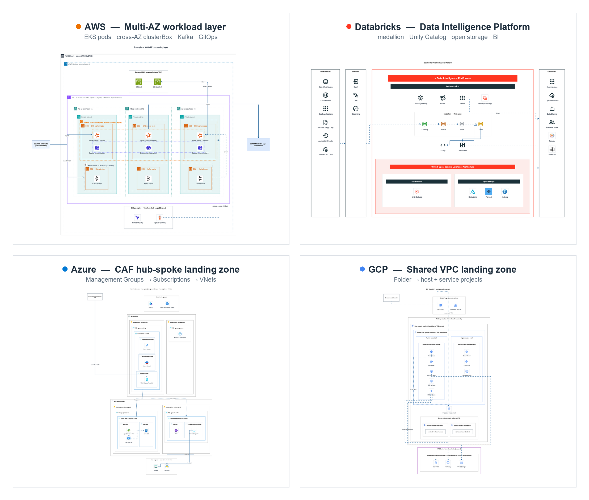

# drawio-ai-kit

An orchestration and validation framework enabling AI agents to generate **structurally precise and aesthetically standardized** draw.io diagrams, optimized for AWS, Azure & GCP architectures.


It mitigates common AI agent hallucinations (such as generating non-existent stencil IDs that result in empty shapes) using three key components:

1. **Declarative Catalog** — A single source of truth mapping draw.io stencil IDs (`mxgraph.aws4.*`) to their respective taxonomies and canonical color palettes.
2. **Design Principles** — Codified architectural and layout rules (`rules/principles.md`).
3. **Structural Validator** — A static analysis engine that audits diagram XML to guarantee stencil references are valid and design principles are satisfied prior to serialization.

Exposed to the AI via the **zero-dependency `drawio-ai` CLI**.

## Showcase

One diagram per platform — all generated end-to-end by the kit: no hand-placed coordinates, real stencils, validated, vision-checked. Full set in [`examples/`](examples/).

<p align="center"></p>

## Quick start

Full install — the CLI plus all 5 Domain Skills (AWS, Azure, GCP, Databricks, BPMN) — in one line:

```bash
npm i -g github:sparklabx/drawio-ai-kit && npx skills add sparklabx/drawio-ai-kit
```

Restart your agent, then try: *"draw an AWS 3-tier web app"*.

The first command puts the `drawio-ai` binary on PATH (installs straight from
GitHub — not yet on the npm registry; see [INSTALL.md](INSTALL.md) to pin a version
or install from a clone). The second registers the Domain Skills with your agent
(the `skills` CLI auto-detects Claude Code, Codex, Gemini CLI, …) — without it the
agent never picks the kit up on its own.

- Just one domain instead: `npx skills add sparklabx/drawio-ai-kit --skill drawio-aws` (`--list` previews all 5)
- Optional, for the full experience: the **draw.io desktop app** enables `drawio-ai render` (the vision self-check); **Graphviz** enables `vendor/autolayout.py` for large graphs. Details in [INSTALL.md](INSTALL.md).

## Is it safe to install?

Short answer: yes — and you don't have to take my word for it.

- **No hidden code.** No `postinstall` (or any lifecycle) hooks — nothing runs on `npm install`. Zero runtime dependencies. **No `sudo`, no `curl | bash`, no remote code.**
- **Zero runtime dependencies.** The single dependency (`@modelcontextprotocol/sdk`) was removed at 1.0.0. The package is now fully self-contained.
- **Runs locally, no telemetry.** The CLI only reads/writes local files. The single optional outbound call is icon-logo fetching from public CDNs (lobe-icons), and it's opt-in.
- **Easy to undo:**

```bash
npm uninstall -g drawio-ai-kit              # remove the CLI
npx skills remove drawio-aws              # remove a domain skill (repeat for each)
```

To report a security issue, see [`SECURITY.md`](SECURITY.md).

## Build a diagram — declarative, no hardcoded coordinates

Define a diagram **topology** (`pipeline`/`hierarchy`/`network`/`hubspoke`/`hybrid`/`mesh`/`sequence`), declare the **nested structure**, and the layout engine programmatically computes spatial coordinates (x/y/w/h) — frames auto-size to fit their children, while rows and columns auto-space. You define the logical topology, not raw pixels.

```js
import { Diagram } from "./src/builder.mjs";
import { group, icon, box, renderTree } from "./src/layout-engine.mjs";

const d = new Diagram("network");
const tree = group("region", "group_region", "Region", { dir: "row" }, [
  group("vpc", "group_vpc", "VPC", { dir: "col" }, [
    icon("alb", "elastic_load_balancing", "ALB"),
    icon("ec2", "ec2", "EC2"),
  ]),
]);
renderTree(d, tree);                 // engine lays everything out + sizes the page
d.title("My VPC");
d.link("alb", "ec2");                // edges by id; router picks straight/corridor
const res = d.validate();            // names real? colors/nesting/labels clean?
// d.mxfile("My VPC")  → write to .drawio, export PNG, then vision self-check
```

Icon names are retrieved from `drawio-ai search` to prevent name fabrication; edge routing, container sizing, alignment, and contextual corner styles are dynamically computed. The AI agent defines the logical layout and iterates via a render-analyze-rectify loop (vision-based self-correction). Example: `examples/aws/build_mesh.mjs` (zero manual coordinates).

## Migration (from <1.0)

At **1.0.0** the MCP server and bespoke installer were removed. To migrate:

- **Install:** switch from `claude mcp add ... mcp-server.mjs` to `npm i -g github:sparklabx/drawio-ai-kit`.
- **Skills:** replace the old `drawio-cloud-architect` skill with the 5 thin Domain Skills — all at once with `npx skills add sparklabx/drawio-ai-kit`, or per domain with `--skill drawio-aws` etc.
- **Vision self-check:** the inline image was replaced by `drawio-ai render` → PNG → `Read`.
- **Uninstall:** `npm uninstall -g drawio-ai-kit` + remove each skill via the skills tooling.

## Template library (`examples/`)

Each file builds one common architecture via the layout engine (zero hardcoded coordinates) — copy one as a starting point. Examples are **organized into domain subfolders** — see [`examples/README.md`](examples/README.md) for the full index. Run any with `node examples/<dir>/<file>` → writes to `out/*.drawio`.

**`examples/aws/`**

| Example | Type | Architecture |
| --- | --- | --- |
| `build_pipeline.mjs` | pipeline | Layered data analytics pipeline (ingest → process → store → serve) + cross-cutting band |
| `build_landingzone.mjs` | hierarchy | AWS Landing Zone / Control Tower org & OUs |
| `build_vpc.mjs` | network | VPC Multi-AZ 3-tier (ALB spanning AZs) |
| `build_vpc_routing.mjs` | network | Subnets + route tables + VPC Endpoint (Gateway) → S3 |
| `build_vpc_eks.mjs` | network | VPC with Bastion, NAT, EKS, Auto Scaling worker nodes |
| `build_vpc_efs.mjs` | network | VPC with Amazon EFS (a mount target per AZ) |
| `build_web3tier.mjs` | network | 3-tier web app (Edge → Web → App → Data) |
| `build_eventdriven.mjs` | hubspoke | Serverless event bus (EventBridge hub → consumers) |
| `build_serverless.mjs` | sequence | Serverless web app, numbered request walkthrough |
| `build_hybrid.mjs` | hybrid | On-prem ↔ AWS over Direct Connect + VPN, mirrored DR |
| `build_mesh.mjs` | mesh | Multi-account connectivity / service mesh |
| `build_iam_accounts.mjs` | hierarchy | Multi-account IAM + cross-account assume-role |

**`examples/azure/` · `gcp/` · `databricks/` · `multicloud/` · `bpmn/`**

| Example | Type | Architecture |
| --- | --- | --- |
| `azure/build_azure_vnet.mjs` | network | Azure N-tier: Subscription → Resource Group → VNet → Subnet tiers |
| `azure/build_azure_hub_spoke_lz.mjs` | network | CAF hub-spoke landing zone (Management Groups, hub + spoke VNets, reserved subnets, peering, private endpoints) |
| `gcp/build_gcp_vpc.mjs` | network | GCP global VPC across two regions (Project → global VPC → regional Subnets) |
| `gcp/build_gcp_shared_vpc_landing_zone.mjs` | network | Shared VPC landing zone (host/service projects, regional Cloud Router/NAT, Interconnect, PSC, VPC-SC) |
| `databricks/build_lakehouse.mjs` | pipeline | Databricks lakehouse medallion (Bronze/Silver/Gold) + Unity Catalog |
| `databricks/build_platform.mjs` | hybrid | Databricks control-plane vs data-plane deployment topology |
| `databricks/build_data_intelligence_platform.mjs` | pipeline | Databricks Data Intelligence Platform reference (signature bands, medallion, foundation) |
| `databricks/build_mlops.mjs` | pipeline | Databricks MLOps — Git provider + Dev/Staging/Prod workspaces + Unity Catalog + Lakehouse |
| `multicloud/build_multicloud.mjs` | hybrid | On-prem + AWS + Azure composed through a neutral interconnect |
| `bpmn/build_bpmn.mjs` | bpmn | BPMN swimlane process (pool → lanes × phases) |

## Runtime architecture
- **Node 18+** (`.nvmrc` pins the current LTS) — orchestration and validation layer: CLI and validator (`src/`). Supported runtimes include Node 20, 22 (LTS), or 24.
- **Python 3.11** (`.python-version`) — data ingestion and compilation pipeline: catalog generator + icon-pack builder (`scripts/build_pack.py`, stdlib only).

Install the dependencies:

```bash
nvm install --lts && nvm use --lts    # or: brew install node
brew install python@3.11              # then: python3.11 --version
```

## CLI commands

| Command | Purpose |
| --- | --- |
| `search` | Find a stencil by keyword/category → returns the exact name + ready-to-paste draw.io `style` (verbatim from the index: real names, official colors, connection points). |
| `style` | Get the full style for one stencil by exact name. |
| `validate` | Lint XML: unknown stencils, dangling edges, missing `aspect=fixed`, **recolored AWS icons**, **broken AWS group nesting**, **geometry (overlap / child spills its frame / stacked arrowheads)**, plus an aesthetic `audit` (font/palette/fan-out/icon-size). |
| `audit` | Aesthetic audit only (font/palette/fan-out/icon-size). |
| `render` | Render the XML to PNG (`drawio-ai render <file> -o out.png`). Needs the draw.io desktop CLI; set `DRAWIO_CLI` to override the path. |
| `logo` | Logo for non-AWS brands (AI/LLM + some) as an `image` style, via `vendor/aiicons.py` (lobe-icons). Needs python3. |
| `categories` | List all catalog categories. |
| `types` | List supported diagram topologies. |
| `principles` | Design rules + architecture preset + catalog categories. Pass `--mode aws|azure|gcp|databricks|bpmn` for a domain. |
| `root` | Print the installed Kit's absolute path (for `import` by path). |
| `workflow` | Print the shared build → validate → render → write workflow. |

Each of the 5 Domain Skills (`drawio-aws`, `drawio-azure`, `drawio-gcp`, `drawio-databricks`, `drawio-bpmn`) wraps these commands into a full build-with-engine → validate → **render + vision self-check** → final-export workflow. Vendored helpers in `vendor/`: `autolayout.py` (Graphviz layout for >15-node graphs), `aiicons.py`, `repair_png.py`, `encode_drawio_url.py` (browser fallback).

## Domain Skills

The kit ships 5 thin Domain Skills — one per cloud/domain — distributed via the standard npm skills tooling:

| Skill | Domain |
| --- | --- |
| `drawio-aws` | AWS |
| `drawio-azure` | Azure |
| `drawio-gcp` | GCP |
| `drawio-databricks` | Databricks |
| `drawio-bpmn` | BPMN |

Add one or more with the `skills` CLI, e.g. `npx skills add sparklabx/drawio-ai-kit --skill drawio-aws` (or drop `--skill` to install all 5; `--list` previews). Each skill is a thin frontend; the deterministic engine, validator, and rules live in the `drawio-ai-kit` package, reached via the `drawio-ai` CLI.

## Other hosts (Coworker AI, Agent SDK, …)

The kit isn't tied to one app — the "brains" live in the **CLI + repo + rules**, so
any Claude host that can run **shell commands** can use it. Point the agent at the
CLI: `drawio-ai principles`, `drawio-ai search`, `drawio-ai validate`, plus the
template index & reproduction loop in `rules/diagram-types.md`. (`draw.io` CLI is
only needed for PNG render / vision-check.)

## CLI usage

```bash
drawio-ai search s3
drawio-ai search kubernetes --category Containers
drawio-ai search "aws cloud" --kind group
drawio-ai style s3
drawio-ai validate ../4_oncloud.drawio
drawio-ai categories
drawio-ai principles --mode aws
drawio-ai render out.drawio -o out.png
```

## Catalog (2106 icons — 983 AWS + 626 Azure + 216 GCP + 281 across 8 OSS packs)

`loadCatalog` merges every `catalog/*.json`, so all icons are searchable together via `drawio-ai search`.

`catalog/aws.json` is generated from `data/shape-index.json.gz` (10,446-shape index from jgraph/drawio-mcp, Apache-2.0) — real stencil names (`s3`, `eks`, `identity_and_access_management`, ...), official per-icon colors, connection points, and `aspect=fixed`, all **verbatim**. No hand-guessing.

Regenerate after refreshing the index:

```bash
python3.11 scripts/ingest_index.py        # data/shape-index.json.gz → catalog/aws.json (983 icons, 19 groups)
```

### Icon packs (non-AWS)

Brand/tech icons for the tools people draw alongside AWS — searchable by name (`spark`, `kafka`, `postgres`, `kubernetes`, `argocd`, `prometheus`, `pytorch`, …) as square tiles in the same house style:

| Pack | Icons | Examples |
|---|---:|---|
| `database` | 66 | postgres, mysql, mongodb, redis, clickhouse, snowflake |
| `bigdata` | 48 | spark, kafka, airflow, flink, trino, dbt, minio |
| `cicd` | 42 | jenkins, argocd, terraform, ansible, sonarqube |
| `aiml` | 26 | pytorch, tensorflow, huggingface, ollama, langchain |
| `containers` | 26 | kubernetes, docker, helm, istio, linkerd |
| `observability` | 26 | datadog, prometheus, grafana, opentelemetry |
| `databricks` | 24 | unity catalog, delta sharing, mosaic ai |
| `network` | 15 | nginx, kong, traefik, haproxy, cloudflare |

The prebuilt `catalog/*.json` are committed — **using** the kit needs no rebuild. To add or refresh a pack, edit `packs/<name>/manifest.json` and:

```bash
python3 scripts/build_pack.py <name>   # devicon → vectorlogo.zone → gilbarbara → simple-icons → text (needs macOS qlmanage)
```

See `THIRD_PARTY_NOTICES.md` for attributions.

## Tests

```bash
npm test        # node --test
```

## Notes & licensing

- The **code** is MIT (see [`LICENSE`](LICENSE)). Bundled **icons/logos** (AWS Architecture Icons + third-party project logos) are trademarks of their owners and are **not** covered by MIT — see [`NOTICE`](NOTICE).
- Prefer **native stencils** (this catalog) over base64 — smaller files, crisp vectors, cleaner licensing.
- Use **base64** (`custom-icons.json`) only for icons draw.io lacks (Confluent, Starburst, OpenMetadata, MinIO, Dagster, internal/brand logos) or when rendering outside draw.io.
- The official AWS Architecture Icons have their own usage terms — review before redistributing a base64 bundle publicly.
- Category colors in the seed are approximate; the generator can refresh them.

## Star History

<a href="https://www.star-history.com/?type=date&repos=sparklabx%2Fdrawio-ai-kit">
 <picture>
   <source media="(prefers-color-scheme: dark)" srcset="https://api.star-history.com/chart?repos=sparklabx/drawio-ai-kit&type=date&theme=dark&legend=top-left&sealed_token=khfogTBEHQVXxmA7TA17wslPm1Z8Y1xLVHqiBakNtSfAfKs1HupFi4mnjz4rJKqOL3arv_od78_f3x_RI67523_8q6yqFAaUZJs92C0kkonv9wci9h22vsv-sOg6HYgHOIBpYpMzQmh4M4pC5LBDdttK2tSAF5FJ4O1R-PkmFQd-kQb3Ax-XjVJiBS4h" />
   <source media="(prefers-color-scheme: light)" srcset="https://api.star-history.com/chart?repos=sparklabx/drawio-ai-kit&type=date&legend=top-left&sealed_token=khfogTBEHQVXxmA7TA17wslPm1Z8Y1xLVHqiBakNtSfAfKs1HupFi4mnjz4rJKqOL3arv_od78_f3x_RI67523_8q6yqFAaUZJs92C0kkonv9wci9h22vsv-sOg6HYgHOIBpYpMzQmh4M4pC5LBDdttK2tSAF5FJ4O1R-PkmFQd-kQb3Ax-XjVJiBS4h" />
   
 </picture>
</a>

